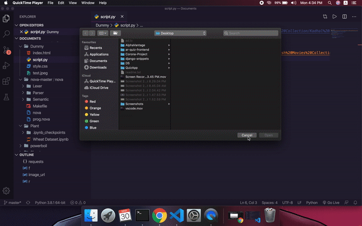

# boilerplate-generator 

Tired of Typing same commands in the Terminal to generate a project in different Frameworks ? BoilerPlate Generator (a.k.a) Powerboil helps you in generating boilerplate code for various Frameworks like React,Django,Flutter,Vue ..etc
